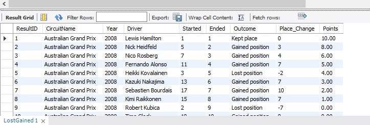

# SQL Project for Code First Girls Kickstarter Course
This is my final project for the Code First Girls SQL Course I attended on May-July 2023.

Project included:
- Database of 5 connected tables;
- Some analytic queries;
- Custom view, function, stored procedure;
- and mandatory live presentation showing all of the above.

## Chosen dataset:
Information about Formula 1 races from year 1950 to 2022 (I used only a part of available files)<br>
Source: Kaggle (https://www.kaggle.com/datasets/rohanrao/formula-1-world-championship-1950-2023).<br>
Why this one?
- as a F1 fan I know how to move around these tables and know what that data actually means,
- since it's all public and well documented, I could double check the results of my queries online.

## Step 1: Creating database and tables<br>
Database schema:<br>


## Step 2: Importing data:
The main table contains over 25.000 rows. Oh, thank you Workbench for the import button!

## Step 3: Let's look at the data!<br>
The main table is fully normalised and looks like this:<br>
<br>

<br><br>
Computers love it, humans hate it, so as the first step I created a more readable view:<br>
```SQL
CREATE OR REPLACE VIEW FriendlyResults AS
SELECT 
	R.ResultID,
    Rc.CircuitName,
    Rc.Year,
    CONCAT(D.Forename," ",D.Surname) as Driver,
    C.ConstructorName as Constructor,
    R.grid as Started,
    R.EndPosition as Ended,
    S.End_Status,
    R.points,
    R.fastestLapTime,
    R.fastestLapSpeed
FROM Results R
JOIN Races Rc on R.RaceID=Rc.RaceID
JOIN Drivers D on R.DriverID=D.DriverID
JOIN Constructors C on R.ConstructorID=C.ConstructorID
JOIN Status S on R.StatusID=S.StatusID
ORDER BY R.ResultID;
```
So now you can actually see the table content: the circuit, year, driver, constructor, start & end position, points etc.<br><br>


And just to play a little more, another view using the first one, showing if the driver has lost or gained the position during the race:<br>
```SQL
CREATE OR REPLACE VIEW LostGained AS
SELECT 
ResultID, CircuitName, Year, Driver, Started, Ended, 
(CASE WHEN Ended - Started < 0 THEN "Gained position"
WHEN Ended - STARTED = 0 THEN "Kept place"
WHEN Ended - Started > 0 THEN "Lost position" END) AS Outcome,
Started - Ended AS Place_Change,
Points
FROM FriendlyResults
ORDER BY ResultID;
```

<br><br>
## Step 4: Analytic queries<br>

<br><br>

<br><br>

<br><br>

<br><br>

## Step 5: Procedure - display drivers championship for chosen year<br>
What this function does is simply calculating the sum of pounts for every driver for the given year then displaying them in descending order.<br>
```SQL
DELIMITER $$
CREATE PROCEDURE DriverRank(IN YearInput CHAR(4))
BEGIN
Select CONCAT(D.Forename," ",D.Surname) as FullName, sum(Points) as Result
FROM Results R
INNER JOIN
	(SELECT RaceID FROM RACES
	WHERE Year = YearInput) Y
	ON Y.RaceID=R.RaceID
INNER JOIN 
	Drivers D on R.DriverID=D.DriverID
GROUP BY FullName
ORDER BY Result DESC;
END $$
DELIMITER ;

CALL DriverRank(2008);
```


## Step 6: Function - has the driver finished the race?<br>
This function gives information based on the status column, to include not only "finished" status, but also the "+ <number> Laps".<br><br>
```SQL
# FUNCTION: checking if the driver has finished the race
# Note: Status "+ _Laps" also means that the driver finished.

DELIMITER $$
CREATE FUNCTION Finished(StatusInput VARCHAR(20))
RETURNS VARCHAR(3)
DETERMINISTIC
BEGIN
	DECLARE Finished VARCHAR(3);
	CASE 
    WHEN StatusInput = 1 THEN SET Finished = "Yes";
    WHEN StatusInput IN (SELECT StatusID FROM Status WHERE End_Status LIKE '%Lap%') THEN SET Finished = "Yes";
    ELSE SET Finished = "No";
    END CASE;
RETURN Finished;
END $$
DELIMITER ;

# How does it work?
SELECT R.ResultID, D.Forename, D.Surname, Rc.Circuitname, Rc.Date, Finished(R.StatusID) as Finished
FROM Results R
JOIN Drivers D on R.DriverID=D.DriverID
JOIN Races RC on R.RaceID=Rc.RaceID
ORDER BY R.ResultID;
```
<br>


## Conclusion<br>
Despite having some previous SQL knowledge, I learned A LOT while making this project. <br>
The hardest part? Giving an online presentation. Not only because I haven't spoken english for a while, but mainly because It was my first time speaking online, without seeing or hearing the people I was talking to. Very strange feeling :)<br>
But in the end, it was so fun! And all I could think of was "I WANT MORE"<br> So now it's time for me to work on much more advanced project.
<br>
Thank you for reading!
